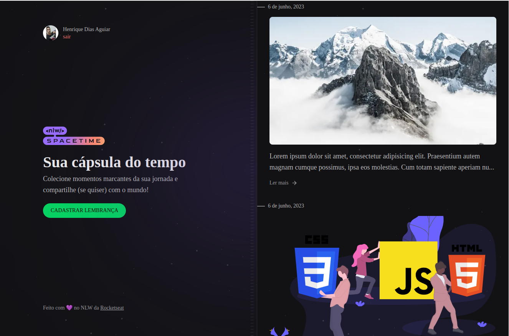

# Spacetime

Spacetime é um projeto full-stack que permite aos usuários autenticar-se com sua conta do GitHub e adicionar memórias com fotos de momentos marcantes. O projeto utiliza Next.js, TypeScript e Tailwind CSS no frontend.



## Instalação

Clone o repositório:

```bash
git clone git@github.com:Henrique-Aguiar/space-time-nlw.git
```

Instale as dependências:

```bash
npm install
```

Crie o arquivo `.env.local`, e defina as variáveis de ambiente com seus respectivos valores:

```makefile
#GitHub
GITHUB_CLIENT_ID=seu-client-id-do-github
```

Inicie a aplicação e acesse em http://localhost:3000:

```bash
npm run dev
```

## Tecnologias usadas

- Next
- Typescript
- TailwindCss
- Eslint
- Js Cookie
- JWT Decode
- Dayjs
- Axios
- TailwindCss Forms
